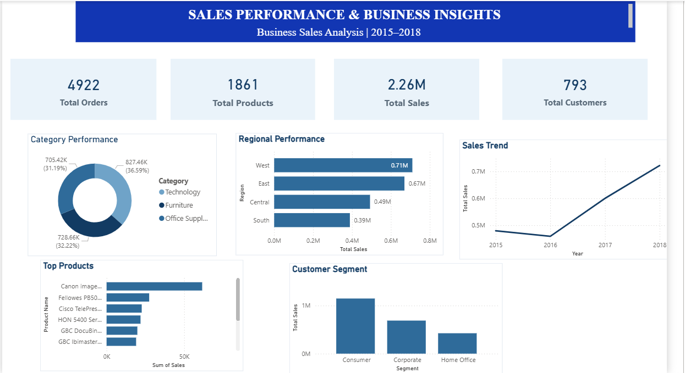

# FUTURE_DS_01 - Business Sales Performance Analytics

## 📊 Project Overview

This project focuses on analyzing business sales data to identify sales trends, top-performing products, category performance, regional performance, and customer segment behavior.

The analysis was developed using **Microsoft Power BI** as part of the Future Interns Data Science & Analytics Internship.

## 🎯 Objectives

- Analyze overall business sales performance
- Identify sales trends across different years
- Analyze sales performance by region
- Identify top-selling products
- Compare product category performance
- Understand sales contribution by customer segment
- Present key business metrics through an interactive dashboard

## 🛠️ Tools & Technologies

- Microsoft Power BI
- DAX
- CSV Dataset
- Data Visualization
- Business Intelligence

## 📈 Dashboard

The Power BI dashboard includes:

- Total Orders
- Total Products
- Total Sales
- Total Customers
- Category Performance
- Regional Performance
- Sales Trend
- Top Products
- Customer Segment Analysis

## 🔑 Key Insights

- Total sales generated: **2.26M**
- Total orders: **4,922**
- Total customers: **793**
- Total products: **1,861**
- The dashboard shows yearly sales trends from **2015 to 2018**.
- Regional performance varies across West, East, Central, and South regions.
- Product-level analysis highlights the highest-selling products.
- Customer segment analysis compares Consumer, Corporate, and Home Office segments.

## 💡 Business Recommendations

- Focus on high-performing products and categories.
- Monitor regional sales performance to identify opportunities for improvement.
- Analyze customer segments to develop targeted sales strategies.
- Track yearly sales trends to support future business planning.
- Use product-level insights to improve inventory and sales decisions.

## 📷 Dashboard Preview

## 📁 Project Files

- `FUTURE_DS_01.pbix` - Power BI dashboard file
- `FUTURE_DS_01_Dashboard.png` - Dashboard preview
- `train.csv` - Dataset used for analysis

## 👩‍💻 Internship

**Future Interns - Data Science & Analytics**

Task: **Business Sales Performance Analytics**

Track: **Data Science & Analytics**
